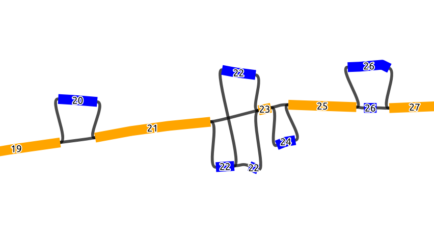
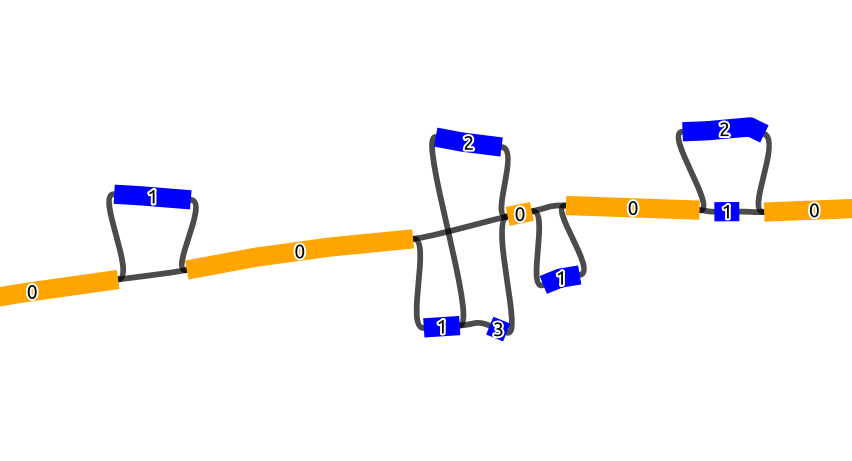

# Ordering Graph

This subcommand establishes an order to the graph based on the "bubbles" in the graph. 
Here, we define the bubbles as biconnected components, i.e. not the strict definition of a bubble found in other papers.

The graph input here has to be an [rGFA](https://github.com/lh3/gfatools/blob/master/doc/rGFA.md), with SN and SO tags.

The basic idea here is that we first detect all biconnected components (bubbles), and collapse the detected bubbles into one node,
which should result in a line graph made from scaffold nodes that belong to the reference and the collapsed bubbles inbetween. We then
order this line graph in ascending order based on the coordinates in the SO tag. Each node in this ordered line graph 
gets an ascending BO tag from 1 to N (N being the number of nodes in the line graph). For the nodes that represent a collapsed
bubbles, all the nodes in that bubble will get the same BO tag (Figure 1). As for the NO tag, the nodes in a bubble get an ascending 
number from 1 to M (M being the number of nodes in a bubble). However, the NO tag inside a bubble is assigned based on the node id order, i.e.
in somewhat random order.
In the graph shown below, which is a part of a longer graph, when the bubbles collapsed, 
this will result in a line graph of 9 nodes.

Below we see a chain of 4 bubbles (biconnected components) and 5 scaffold nodes, where the nodes inside
the bubbles are colored blue and the scaffold nodes are colored yellow. The numbers of the node is the 
BO tag, where it increases by 1 starting from the first scaffold node on the left (19 to 27), and we see that 
all the nodes in a bubble have the same BO tag

In this figure, we see the same graph but with the NO tags marked on the nodes. Scaffold nodes always 
have a NO tag of 0, and the nodes inside a bubble are marked with an increasing order of the NO tag.
