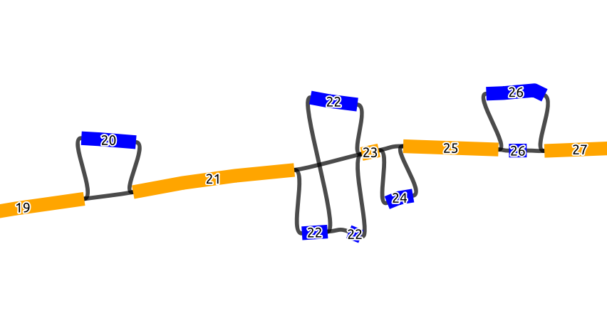
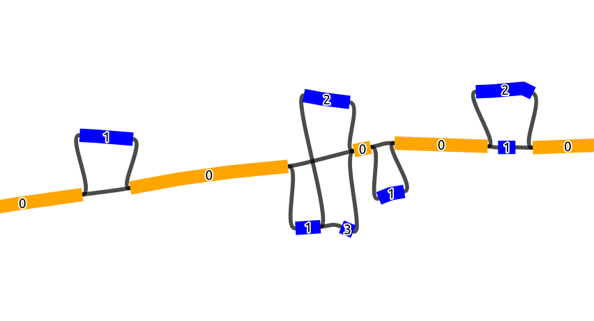

.. _user-guide:

==========
User Guide
==========

The following subcommands are available in gaftools

* :ref:`index <gaftools-index>` - indexing a GAF file for the view command.
* :ref:`order_gfa <gaftools-order-gfa>` - Ordering GFA file using BO and NO tags.
* :ref:`phase <gaftools-phase>` - Adding phase information of the reads from a haplotag TSV.
* :ref:`realign <gaftools-realign>` - Realigning GAF alignments using wavefront alignment.
* :ref:`sort <gaftools-sort>` - Sorting GAF alignments using BO and NO tags of the corresponding graph.
* :ref:`stat <gaftools-stat>` - Basic statistics of the GAF file.
* :ref:`view <gaftools-view>` - Viewing and subsetting the GAF file.

To get help for all the subcommands, please use::

    gaftools <subcommand> --help

Requirements:

* gaftools assumes that the GFA file provided is an rGFA and requires tags like :code:`SN`, :code:`SO`, :code:`LN`, and :code:`SR`.

Links to related resources:

* `rGFA and GAF documentation <https://github.com/lh3/gfatools/blob/master/doc/rGFA.md>`_
* `GFA v1.0 documentation <https://github.com/GFA-spec/GFA-spec/blob/master/GFA1.md>`_
* `GFA v2.0 documentation <https://github.com/GFA-spec/GFA-spec/blob/master/GFA2.md>`_

.. _gaftools-index:

gaftools index
==============

This subcommand creates a index file with the extension :code:`.gvi` which is used by the :code:`view` command to subset alignments.
The index is a reverse look-up table with the keys being nodes in the graph and the values being the location of the alignments which have the nodes.

.. _gaftools-order-gfa:

gaftools order_gfa
==================

This subcommand establishes an order to the graph based on the "bubbles" in the graph.
Here, we define the bubbles as biconnected components, i.e. not the strict definition of a bubble found in other papers.

The graph input here has to be an `rGFA <https://github.com/lh3/gfatools/blob/master/doc/rGFA.md>`_, with SN and SO tags.

The basic idea here is that we first detect all biconnected components (bubbles), and collapse the detected bubbles into one node,
which should result in a line graph made from scaffold nodes that belong to the reference and the collapsed bubbles inbetween. We then
order this line graph in ascending order based on the coordinates in the SO tag. Each node in this ordered line graph
gets an ascending BO tag from 1 to N (N being the number of nodes in the line graph). For the nodes that represent a collapsed
bubbles, all the nodes in that bubble will get the same BO tag (Figure 1). As for the NO tag, the nodes in a bubble get an ascending
number from 1 to M (M being the number of nodes in a bubble). However, the NO tag inside a bubble is assigned based on the node id order, i.e.
in a lexicographic order of the node IDs.
In the graph shown below, which is a part of a longer graph, when the bubbles collapsed,
this will result in a line graph of 9 nodes.

Below we see a chain of 4 bubbles (biconnected components) and 5 scaffold nodes, where the nodes inside
the bubbles are colored blue and the scaffold nodes are colored yellow. The numbers of the node is the
BO tag, where it increases by 1 starting from the first scaffold node on the left (19 to 27), and we see that
all the nodes in a bubble have the same BO tag

In this figure, we see the same graph but with the NO tags marked on the nodes. Scaffold nodes always
have a NO tag of 0, and the nodes inside a bubble are marked with an increasing order of the NO tag.

Usage
-----
The :code:`order_gfa` subcommand takes an rGFA as an obligatory input to order. Optionally, the user can specify 1 or more chromosome to be sorted,
which are given after :code:`--chromosome_order`, and the chromosome name(s) should match the SN tags in the rGFA.
Users can also specify an output directory.

The outputs of :code:`order_gfa` are separate rGFA graphs for each chromosome and a graph for all chromosomes both ordered by S lines first then L lines, and the S lines are ordered by
their BO tag then NO tag, also will output a CSV file with node colors similar to the figure above that works with Bandage.

.. code-block::
    :caption: order_gfa arguments

    usage: gaftools order_gfa [-h] [--chromosome_order CHROMOSOME_ORDER] [--with-sequence] [--outdir OUTDIR] GRAPH

    Ordeing the bubble of the GFA by adding BO and NO tags.

    The BO (Bubble Order) tags order the bubbles in the GFA.
    The NO (Node Order) tags order the nodes in a bubble (in a lexicographic order).

    positional arguments:
      GRAPH                 Input rGFA file

    options:
      -h, --help            show this help message and exit
      --chromosome_order CHROMOSOME_ORDER
                            Order in which to arrange chromosomes in terms of BO sorting. Expecting comma-separated list. Default: chr1,...,chr22,chrX,chrY,chrM
      --with-sequence       Retain sequences in output (default is to strip sequences)
      --outdir OUTDIR       Output Directory to store all the GFA and CSV files. Default location is a "out" folder from the directory of execution.

.. _gaftools-phase:

gaftools phase
==============

This subcommands adds the phase information of the GAF reads from a haplotag TSV file generated using
:code:`whatshap haplotag`.

.. _gaftools-realign:

gaftools realign
================

This subcommand realigns all the alignments in GAF back the rGFA it was originally aligned to using Wavefront Alignment.
This fixes alignment issues found in GraphAligner where large indels are represented as a series of small indels in the
CIGAR string.

Usage
-----
The :code:`realign` subcommand takes 3 obligatory input files, the GAF alignments, the rGFA graph that was used for the alignments,
and the reads that correspond to the alignments in the GAF file.

Due to the high memory consumption of :code:`pyWFA` with longer alignments, :code:`gaftools` limits the alignments to 60,000 base pairs in length
and  the alignments that are longer will be outputted as is from the input file.
Moreover, :code:`realign` can be sped up by using more cores. However, for longer alignments, memory can peak substantially, so users should be aware
that they need to maybe use a cluster with sufficient memory. For example, we tested alignments that were between 50,000 and 60,000 bp long, and when
:code:`gaftools` was given 10 cores, the memory peaked to around 100 Gb at certain points, and with 1 core, it peaked at around 20 Gb. In case one of the subprocesses gets killed
by the system due to high memory consumption, the realignment run will be aborted.

.. code-block::
    :caption: realign arguments

    usage: gaftools realign [-h] [-o OUTPUT] [-c CORES] GAF rGFA FASTA

    Realign GAF file using wavefront alignment algorithm (WFA)

    positional arguments:
      GAF                   Input GAF file (can be bgzip-compressed)
      rGFA                  reference rGFA file
      FASTA                 Input FASTA file of the read

    options:
      -h, --help            show this help message and exit
      -o OUTPUT, --output OUTPUT
                            Output GAF file. If omitted, use standard output.
      -c CORES, --cores CORES
                            Number of cores to use for alignments.

.. _gaftools-sort:

gaftools sort
=============

This subcommand sorts the alignments in the GAF file using the BO and NO tags generated by :code:`gaftools order_gfa`. Hence this
subcommand requires initial processing of the rGFA with :code:`order_gfa`.

.. _gaftools-stat:

gaftools stat
=============

This subcommand returns basic statistics of the GAF alignments like number of primary and secondary alignments, total aligned bases,
average mapping quality, etc.

.. _gaftools-view:

gaftools view
=============

This subcommand helps view the GAF alignments, convert formatting from stable to unstable and vice-versa, and subsetting
the files based on nodes or regions given by the user.
